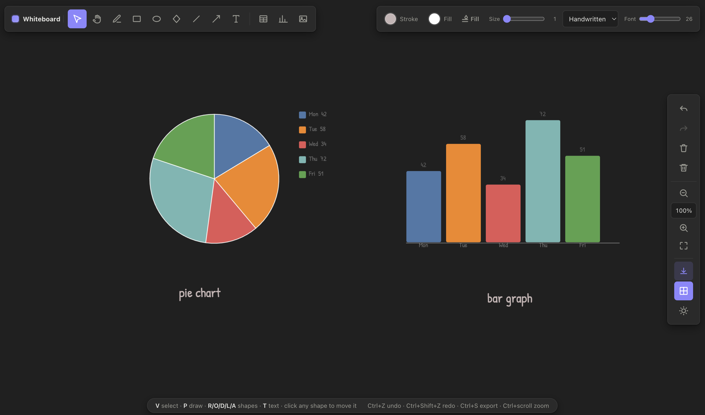

# ProjectFlow Whiteboard

A browser-based infinite whiteboard for notes and drawing — an Excalidraw-style clone
with extra features: editable **tables**, data-driven **charts** (bar / line / pie),
and **image insertion**.

<p align="center">
  
</p>

## Features

- **Drawing tools** — freehand, rectangle, diamond, ellipse, arrow, line, and
  click-to-type text. Shapes draw as **outlines**; use the **Fill** button to fill
  the current selection (or all new shapes).
- **Styling** — stroke/fill colors, stroke width, and a **handwritten** default
  font (Patrick Hand) with family & size options.
- **Tables** — insert a table by choosing rows and columns, then fill the cells.
  Double-click any placed table to edit it.
- **Charts** — bar, line, and pie charts with editable labels, values, and colors.
- **Canvas & workflow** — pan, zoom (Ctrl+scroll or toolbar), grid toggle,
  light/dark themes, undo/redo, delete, and clear. Click any shape to move it.
- **Export / import** — export PNG / SVG / JSON, import JSON back, and drop or
  insert images directly onto the board.

## Tech stack

- **React 19** — UI built with hooks
- **fabric.js 7** — canvas rendering, object model, and interaction
- **Vite 8** — dev server and production builds
- **oxlint** — linting
- Vanilla CSS with CSS variables for theming

## Getting started

```bash
npm install
npm run dev       # dev server (HMR)
npm run build     # production build -> dist/
npm run preview   # preview production build
npm run lint      # run oxlint
```

Open the printed local URL, pick a tool, and start drawing.

## Keyboard shortcuts

| Key | Action |
| --- | --- |
| `V` | Select / move |
| `H` | Pan |
| `P` | Freehand draw |
| `R` / `O` / `D` / `L` / `A` | Rectangle / Ellipse / Diamond / Line / Arrow |
| `T` | Text |
| `Ctrl+Z` / `Ctrl+Shift+Z` | Undo / Redo |
| `Ctrl+S` | Export PNG |
| `Ctrl+A` | Select all |
| `Del` / `Backspace` | Delete selection |
| `+` / `-` | Zoom in / out |
| `Ctrl+scroll` | Zoom to cursor |
| `Esc` | Deselect / exit text editing |